# non-contact-vital-sign-sys

A contactless RGB-D based system for identity authentication, age/gender estimation, height/weight measurement, and pain-site marking designed for outpatient workflow applications.

This repository accompanies the thesis:

**“A Non-contact Multimodal Sensing and Vital Sign Estimation System for Outpatient Workflow Applications”**

---

## 🌟 System Overview

This project integrates Microsoft Kinect RGB-D sensing with deep learning–based estimation modules to build a fully contactless outpatient check-in and physiological measurement system.

### 🔶 Overall System Architecture
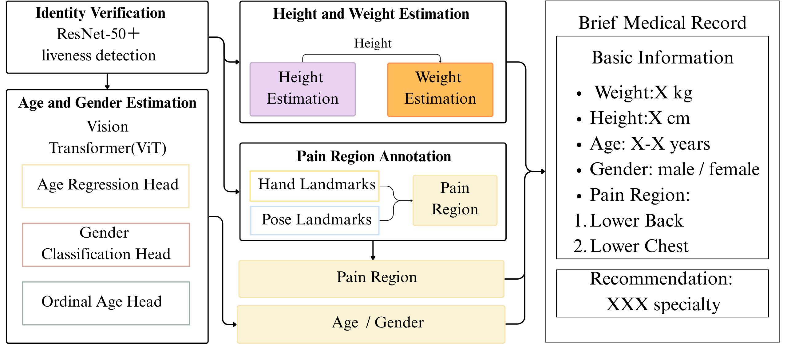

---

## 🔍 Module Designs (Architectures)

### 🧩 1. Identity Authentication
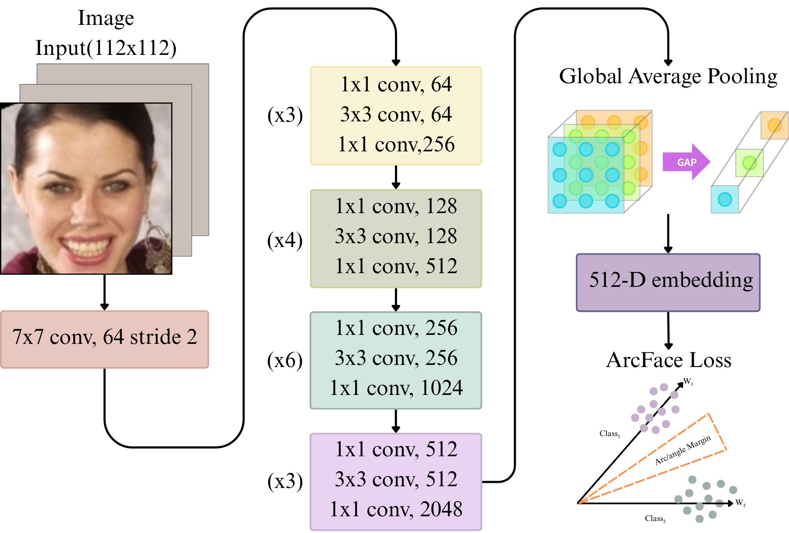

### 🧩 2. Age & Gender Estimation (ViT)
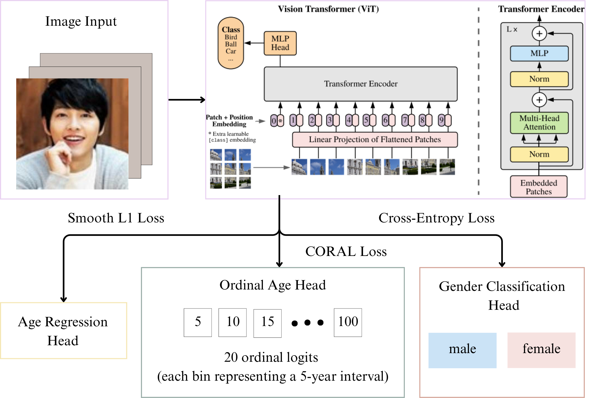

### 🧩 3. Height & Weight Estimation
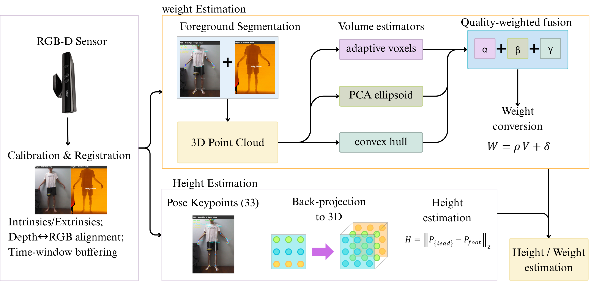

### 🧩 4. Pain-site Marking
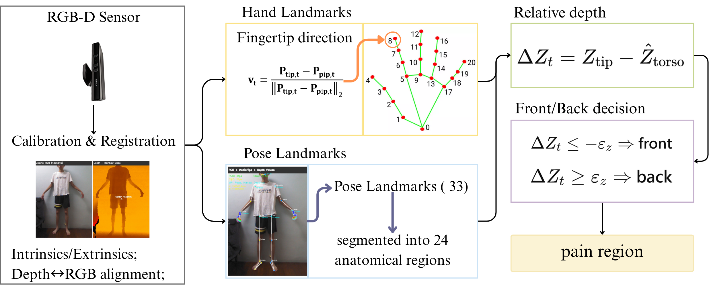

---

## 🚶‍♂️ System Workflow (Chapter 3)
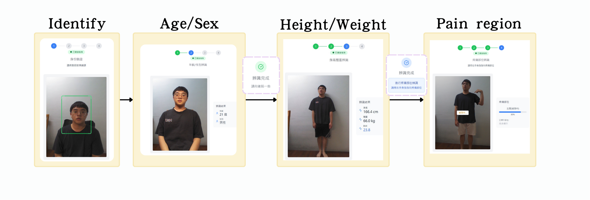

---

# 📊 Experimental Results

Below are the results from each module.

---

## 🔹 1. Identity Authentication Results (ArcFace + Liveness)

| ROC Curve | Similarity Histogram | t-SNE Embedding |
|----------|----------------------|------------------|
| 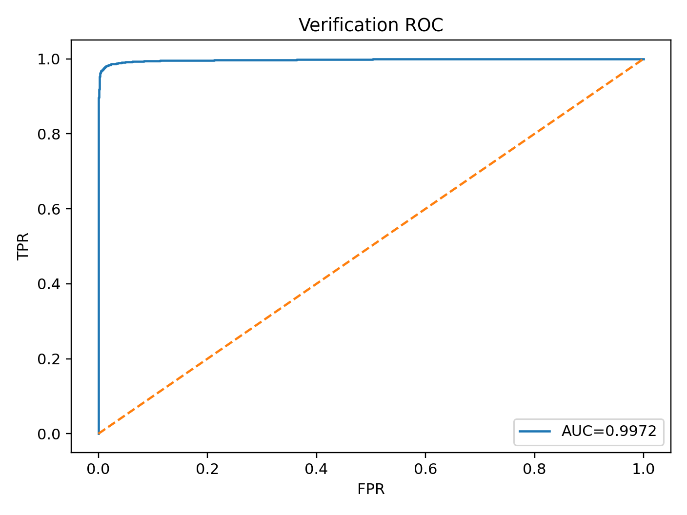 | 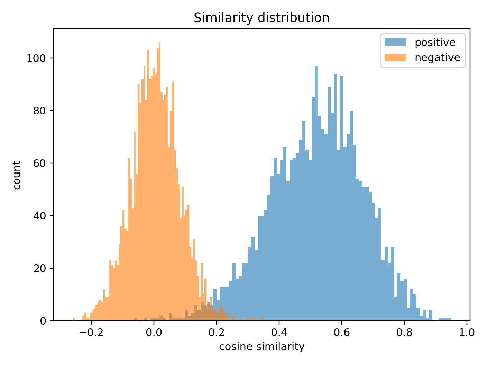 | 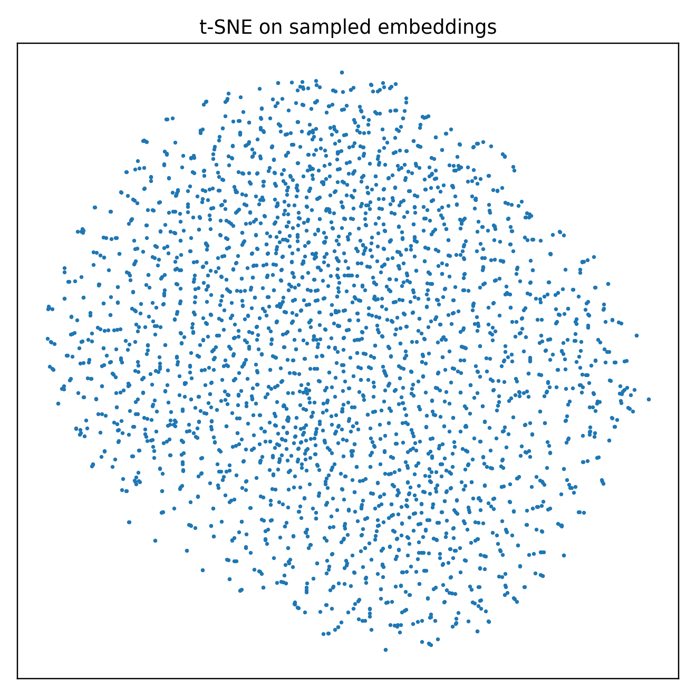 |

---

## 🔹 2. Age & Gender Estimation Results (ViT)

### Age Regression Scatter Plot
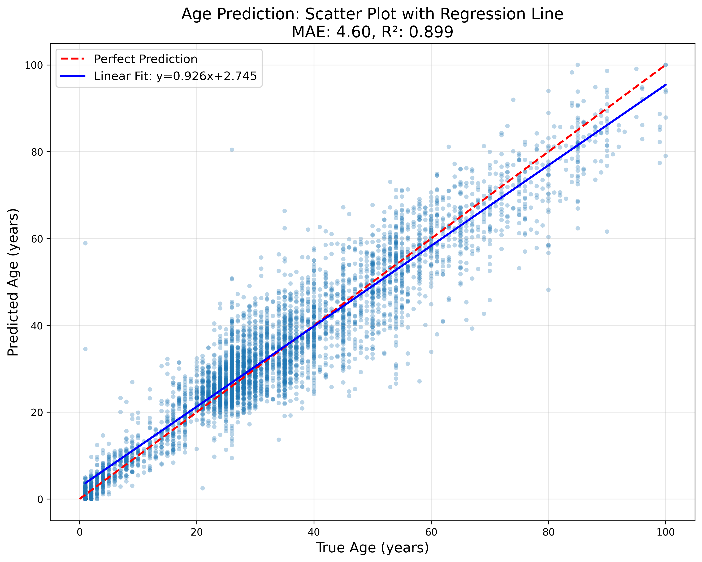

### Gender Confusion Matrix
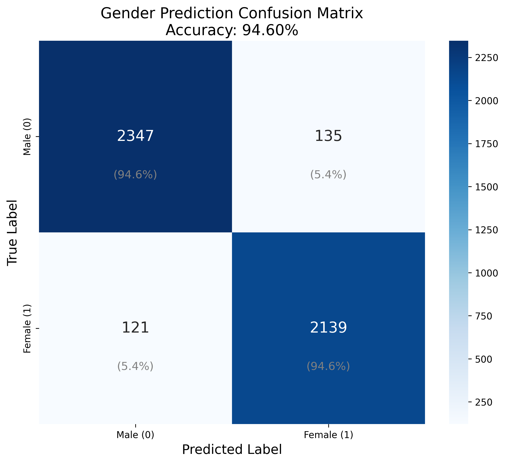

### Gender ROC Curve
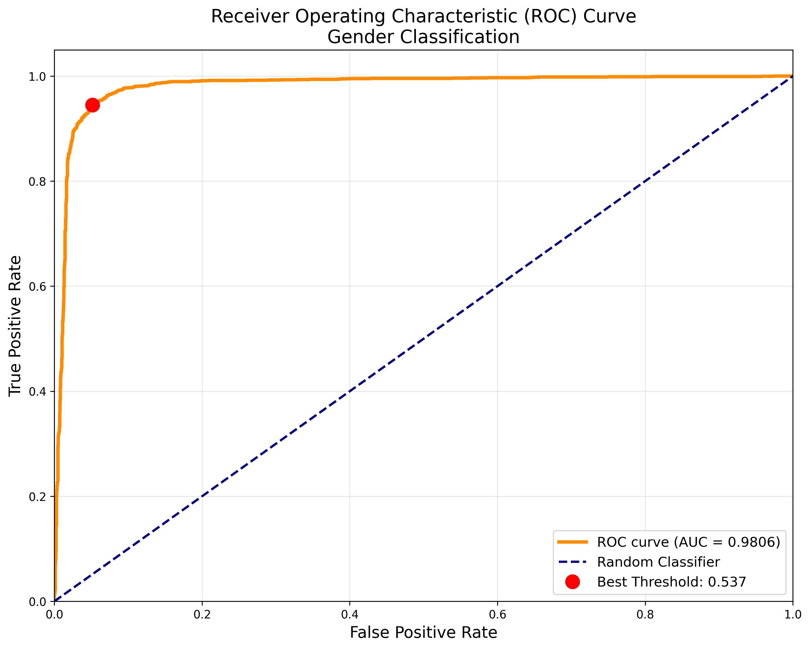

---

## 🔹 3. Pain-site Detection Results

### Pain Point Example
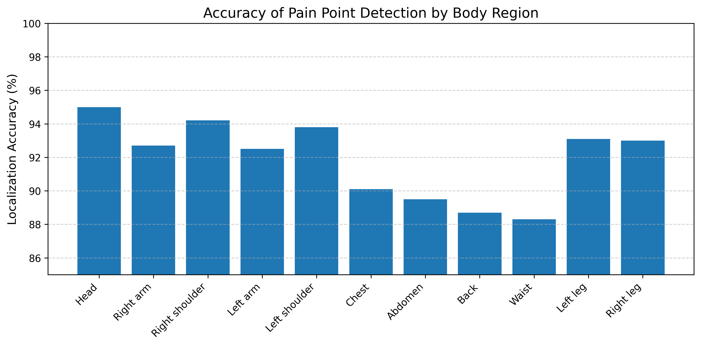

### Pain Back / Chest Examples
<div style="display: flex; gap: 10px;">
    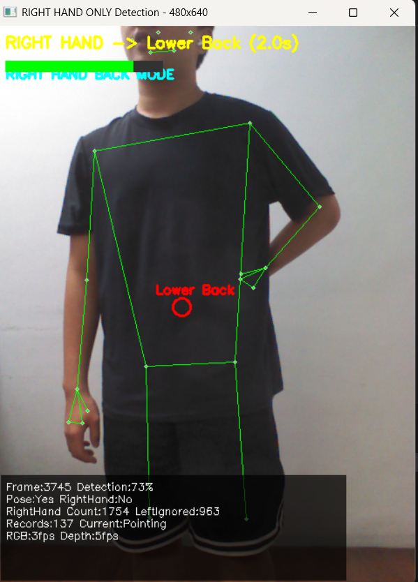
    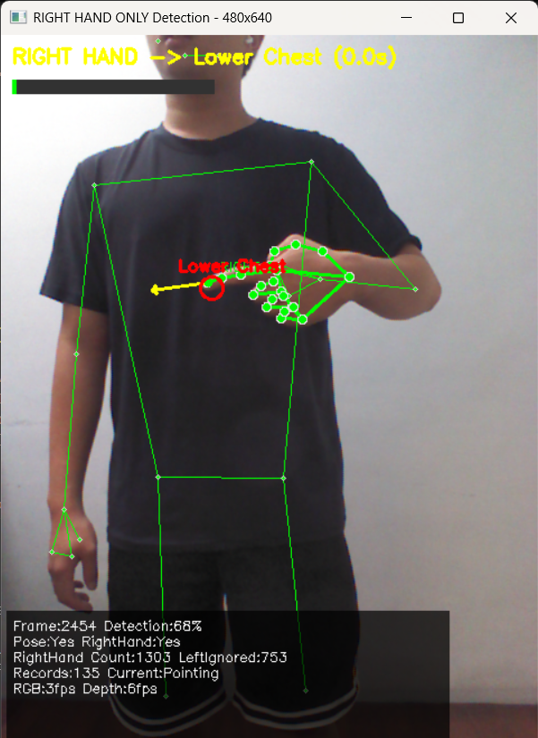
</div>

---

# 📁 Repository Structure

```txt
non-contact-vital-sign-sys/
│
├── README.md
├── requirements.txt
│
├── src/
│   ├── auth_module.py
│   ├── age_gender_module.py
│   ├── height_weight_module.py
│   ├── pain_marker_module.py
│   └── common_utils.py
│
├── experiments/
│   ├── configs/
│   └── logs/
│
├── results/
│   ├── auth/
│   ├── age_gender/
│   ├── height_weight/
│   └── pain_marker/
│
└── docs/
